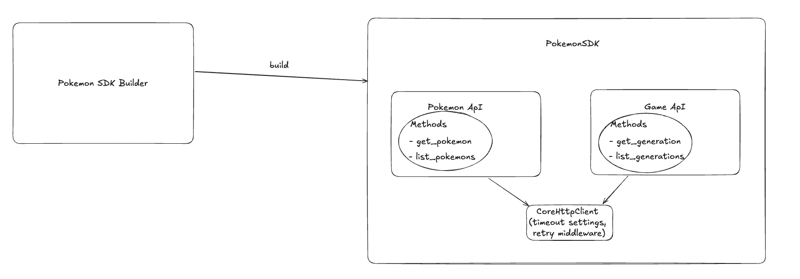

# Pokemon API SDK
This SDK exposes `PokemonSdk` which can be used to call different group of Apis present on  [Pokemon API website](https://pokeapi.co/docs/v2)

[Pokemon API website](https://pokeapi.co/docs/v2) exposes api under different groups
- Games
- Item
- Pokemon
- etc...

Currently the SDK only supports the following
1. fetching a specific `Pokemon` from the `Pokemon Group`
2. fetching a specific `Generation` from the `Games Group`.
3. fetching list of pokemons
4. fetching list of game generations

# Prerequisites
1. Install Rust on your machine. [More info here](https://www.rust-lang.org/tools/install)

# How to use
1. In order to initiate `PokemonSdk` we need to first construct a `PokemonSdkBuilder`. `PokemonSdkBuilder` is used to generate `PokemonSdk`.
2. `PokemonSdkBuilder` has various methods to alter different configurations. Eg change environment, timeout, http client to use , retry strategy on transient errors.
3. After making changes to `PokemonSdkBuilder` the final step is to call `build()` on `PokemonSdkBuilder`. This returns a `PokemonSdk`.
4. `PokemonSdk` can be used to fetch pokemon details. Eg `PokemonSdk.pokemon().pokemon_details("Pikachu")`
5. When using `PokemonSdk` to fetch list of pokemons you can pass in `PaginationConfig` which decides how many results will be loaded. Eg. `pokemon_sdk.pokemon().list_pokemons(Some(PaginationConfig::get_default()))`

For more details check the examples folder. It contains sample code on how to use the SDK.

# How to test
1. Go the base folder of the sdk.
2. Run the following command - `cargo t`
3. If you want to run a specific test use - `cargo t get_generations_returns_a_list_of_generations`
4. If you want to run a specific test use and see output of any print/debug statements use - `cargo t get_generations_returns_a_list_of_generations -- --nocapture`
5. If you want to run a specific test use and see traces - `RUST_LOG=info cargo t get_generations_returns_a_list_of_generations -- --nocapture`

Possible values for Rust_Log environment variable check [here](https://docs.rs/tracing/latest/tracing/struct.Level.html#implementations). Most interesting log levels are `debug` & `info`

# Architecture

## Crates used
1. `reqwest` crate for making api calls
2. `serde` crate for deserialization
3. `tracing` crate for adding traces to the lib

## Errors
`PokemonSdkError` is the type which encapulates all the different types of errors that can be produced by the SDK.

## Tracing
The application using this SDK can use environment variable to define the level of traces to produce.
For more information refer to [Tracing crate](https://docs.rs/tracing/latest/tracing/index.html)
